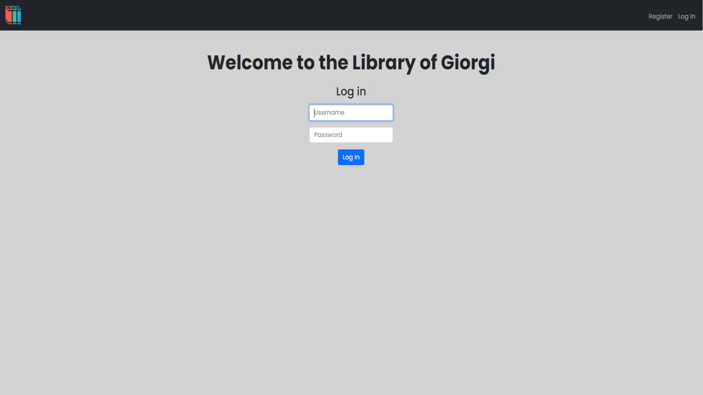

# Library Management Mini-Project

## Description

Welcome to the Library Management Mini-Project! This application allows users to create a personal library by storing their favorite books. Users can register, sign in, and manage their book collection in the database. The project is built using Python/Flask, HTML, CSS, and SQLite3.

### Features

- User registration and login functionality
- Add, update, and delete favorite books
- Organize books with title, author, genre, rating, shelves (To-read or read), and dates
- Use of sessions to track and manage user data

## Database Structure

The application is designed with two tables in the database:

1. **users**: Stores unique user IDs and manages user sessions.
2. **books**: Contains book details such as book ID, user ID, title, author, genre, rating, shelves, and dates.

## Getting Started

Follow these steps to set up and run the Library Management Mini-Project on your local machine:

1. Clone this repository: `git clone https://github.com/drstrangelove193/Library-flask-crud-app.git`
2. Navigate to the project directory: `cd LIBRARY`
3. Install dependencies: `pip install -r requirements.txt`
4. Run the Flask app: `flask run`

## Usage

- Register or log in to access your library
- Add your favorite books with details
- Update or delete books as needed

## Layout and Styling

The project utilizes Bootstrap and custom CSS for styling. The main layout includes a navbar with options for adding books, logging in, and registering. The `main` tag is used to contain the content of various pages.

## Acknowledgments

This mini-project was both challenging and rewarding, providing valuable experience as a beginner in the field of Computer Science. Special thanks to the CS50 Staff and Harvard University for the guidance and support.

For inquiries or feedback, please contact me at giorgioragvelidze1@gmail.com

